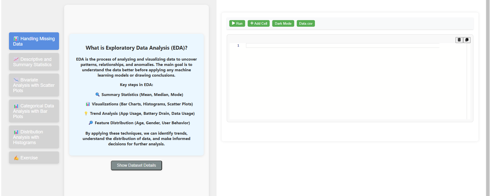
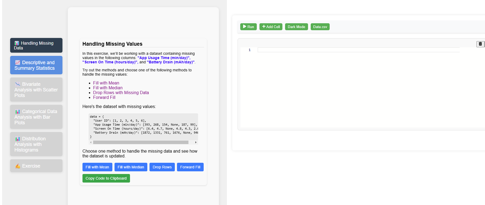
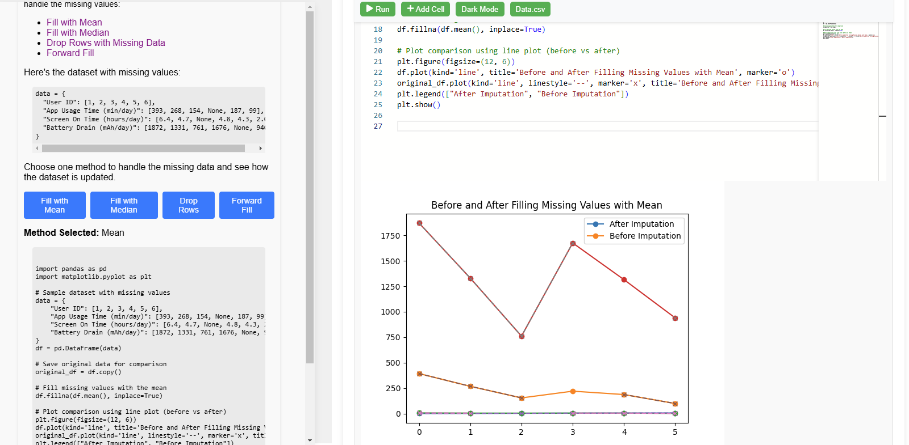
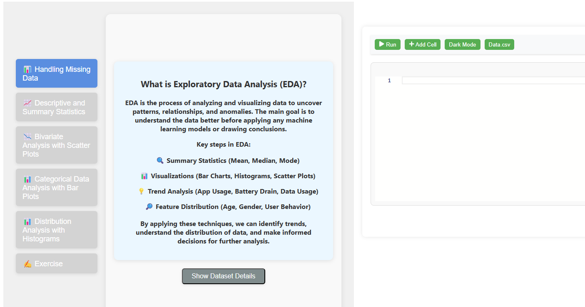
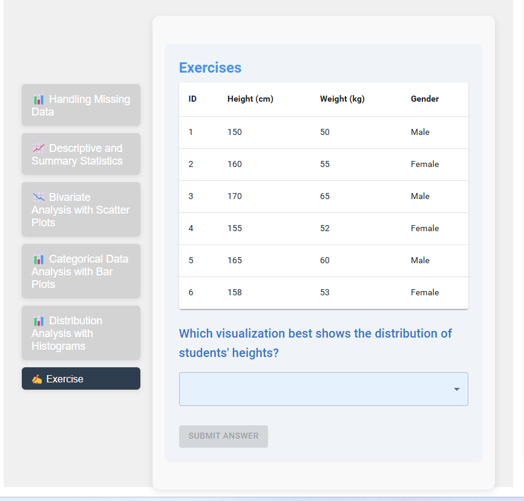

<strong>Step 1:</strong> Observe the code editor and read the instructions carefully.

<strong>Step 2:</strong> Click the <strong>“Handling Missing Values”</strong> button to learn the concepts of handling missing values.

<strong>Step 3:</strong> Read the instructions provided and choose one of the methods for handling missing values.

<strong>Step 4:</strong> Copy the corresponding code into the code editor and run it.

<strong>Step 5:</strong> Observe the results and analyze the insights.

<strong>Step 6:</strong> Repeat the process with the other buttons and observe the results for each method.

<strong>Step 7:</strong> After completing all the EDA methods, click the <strong>“Exercise”</strong> button to start the exercise.

<strong>Step 8:</strong> Choose the correct option, submit your answer, and observe the results.
